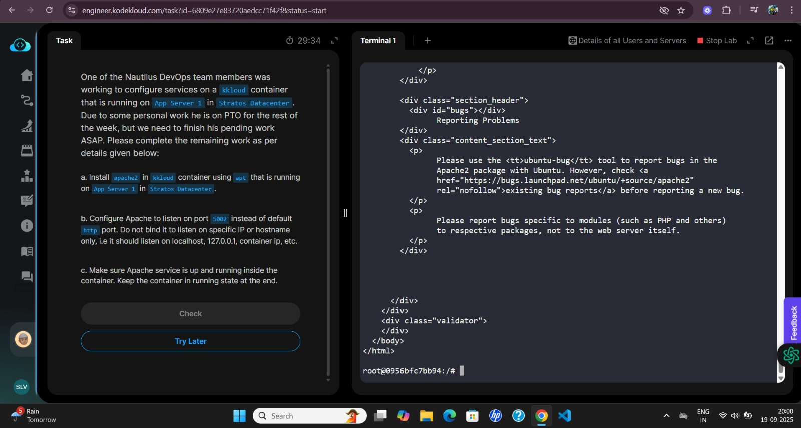

# 🚀 Day 40 Challenge - Apache Setup in Container

## 📌 Task Description
One of the Nautilus DevOps team members was working to configure services on a **kkloud container** that is running on **App Server 1** in Stratos Datacenter. Due to some personal work, he is on PTO, and we need to finish his pending work.

### The requirements are:
1. Install **apache2** in the `kkloud` container using `apt`.
2. Configure Apache to listen on **port 5002** instead of the default port 80.  
   - Do not bind to a specific IP, it should listen on all (localhost, 127.0.0.1, container IP, etc.).
3. Make sure Apache is **up and running** inside the container.
4. Keep the container in **running state** at the end.

---

## 📖 Basics You Should Know

### 🔹 What is a Container?
- A **container** is like a lightweight virtual machine.  
- It allows you to run applications in isolation from the host system.  
- Example: Think of it as a mini-computer inside your main computer.

### 🔹 What is Apache2?
- **Apache2** is a web server software that serves web pages.  
- By default, it runs on **port 80 (HTTP)**.  
- In this task, we configure it to run on **port 5002**.

### 🔹 Why Change the Port?
- To avoid conflicts with other services.  
- Sometimes projects require custom ports.  

---

## 🛠️ Step-by-Step Implementation

### Step 1: Login to App Server 1
We first log in to App Server 1 where the container is running:
```bash
ssh <username>@<app-server-1-ip>
```
👉 This gives us access to the host machine.

---

### Step 2: Check Container and Access It
```bash
docker ps
docker exec -it kkloud bash
```
👉 `docker ps` lists running containers.  
👉 `docker exec -it kkloud bash` lets us enter the container in interactive mode.

---

### Step 3: Install Apache2
```bash
apt update
apt install apache2 -y
```
👉 `apt update` updates the package list.  
👉 `apt install apache2 -y` installs apache2 without asking for confirmation.

---

### Step 4: Change Apache Port to 5002
Apache configuration files:
- `/etc/apache2/ports.conf`
- `/etc/apache2/sites-enabled/000-default.conf`

Since no editor (`nano` or `vi`) was installed, we used `sed` to directly modify the files.

```bash
sed -i 's/Listen 80/Listen 5002/' /etc/apache2/ports.conf
sed -i 's/<VirtualHost \*:80>/<VirtualHost *:5002>/' /etc/apache2/sites-enabled/000-default.conf
```
👉 `sed -i` edits files **in place** (no need for an editor).  
👉 First command updates the listening port.  
👉 Second command updates the virtual host configuration.

---

### Step 5: Restart Apache
```bash
service apache2 restart
```
👉 Restarts Apache so it applies the new port configuration.

---

### Step 6: Verify Apache is Running
Check service status:
```bash
service apache2 status
```
Check if listening on port 5002:
```bash
ss -tulnp | grep 5002
```
Test with curl inside container:
```bash
curl http://localhost:5002
```
👉 Should return the default Apache page (`It works!`).

---


---

## ⚠️ Error Faced During Task
- When trying to edit config file with `nano`:
  ```bash
  nano /etc/apache2/ports.conf
  ```
  ❌ Error: `command not found`
- Tried `vi`:
  ```bash
  vi /etc/apache2/ports.conf
  ```
  ❌ Error: `command not found`
- **Solution**: Installed editor or used `sed`. We used `sed` because it works without additional installs.

---


---

## ✅ Final Summary
- Logged into **App Server 1**.  
- Accessed the **kkloud** container.  
- Installed **Apache2** inside the container.  
- Configured Apache to listen on **port 5002** using `sed`.  
- Restarted the Apache service.  
- Verified that Apache is **running and listening on port 5002**.  
- Ensured the container remains in **running state**.  

🎯 **Day 40 Challenge Completed Successfully!**